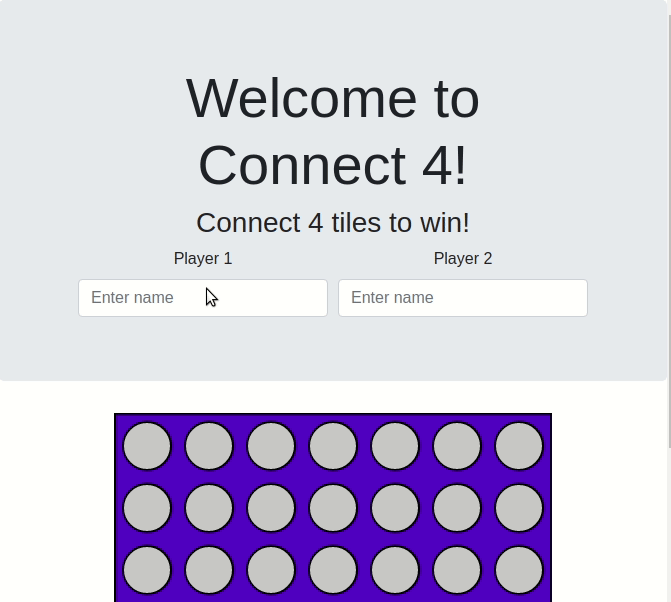

# Django-Python-Full-Stack-Web-Developer
Notes and files for the Python full stack developer course!

Note that the original course content and my own worked examples exist in the same folders - the corse content files are generally of the form 
Part1_xxxx.js
Part2_xxxx.html

and I have created files in the same directories with different names for my worked examples. 

This repository is not intended as a collaborative project like my others, and I request you don't clone it. 

